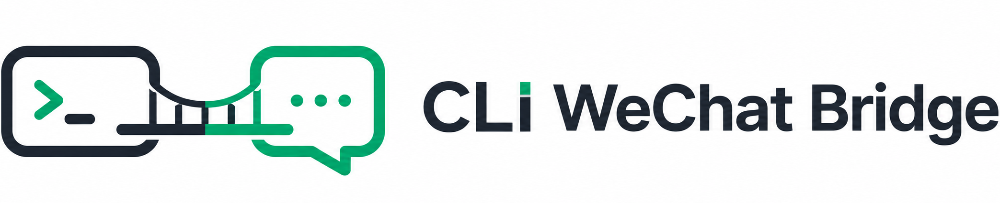
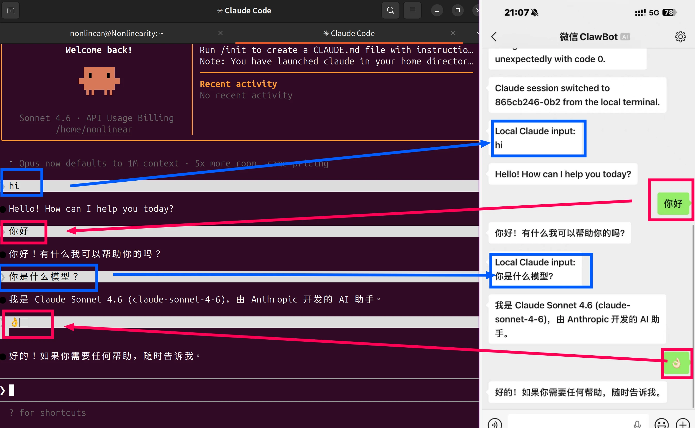

# CLI WeChat Bridge



**命令行工具的微信桥接**：本项目用于桥接微信消息与本地运行的 [`Codex`](https://github.com/openai/codex)、[`Claude Code`](https://code.claude.com/docs/en/overview)、`OpenCode` 或持久化 `powershell.exe` 会话，并将本地输出、审批请求与运行状态同步回微信。

当前实现以本地工作流为中心展开，重点是保留本地原生终端体验，并在此基础上提供微信侧的远程输入、结果回流与状态同步能力。



## 这个项目解决什么问题

本项目面向这样一类使用场景：

- 你的主工作流仍在本地终端中进行；
- 你希望继续使用原生 `codex` 或其他 CLI 工具，而不是迁移到网页或托管机器人；
- 你希望在离开电脑时，仍能通过微信向本地会话发送请求，并接收必要的输出、与状态同步。

当前项目并不试图把微信变成新的主工作界面。相反，它的定位是：

- 本地 CLI 仍然是主工作界面，并保持原生的使用逻辑；
- 微信是远程入口，允许远程接入；
- 会话一致性、线程状态和审批流仍以**本地会话为中心**。

## 快速开始

### 1. 环境要求

- Windows 为当前主要验证环境
- [Node.js](https://nodejs.org/en/download) `>= 24.0.0`（建议直接安装官网 LTS 版本）
- [Bun](https://bun.sh/docs/installation) `>= 1.0.0`
- 已安装以下至少一种本地 CLI：（最好更新至最新版本）
  - [Codex](https://github.com/openai/codex)
  - [Claude Code](https://code.claude.com/docs/en/overview)
  - OpenCode
  - powershell.exe

### 2. 安装

正式版本可以直接从 npm 安装：

```bash
npm install -g @unlinearity/cli-wechat-bridge@latest
```

安装后可在任意项目目录中直接使用 `wechat-codex-start`、`wechat-claude-start`、`wechat-opencode-start` 等命令。

如果你希望从源码运行或参与开发，也可以克隆仓库并安装依赖：

```bash
git clone https://github.com/UNLINEARITY/CLI-WeChat-Bridge
cd CLI-WeChat-Bridge
bun install
```

如果使用源码仓库，希望将当前工作区安装为全局命令：

```bash
npm install -g .
```

开发阶段也可以使用：

```bash
npm link
```

说明：

- `npm link` 会让全局命令直接指向当前仓库源码；
- `npm install -g .` 会安装一份当前仓库的复制版本；后续代码更新后需要重新执行一次。

### 3. 完成微信登录

npm 全局安装后可以直接运行：

```bash
wechat-setup
```

如果是在 clone 的仓库目录下，也可以运行：

```bash
bun run setup # 绑定微信 ClawBot
```

该流程会：

1. 获取微信登录二维码；
2. 在终端打印二维码；
3. 等待你在微信中扫码并确认；
4. 将 bot 凭据写入本地数据目录。


默认凭据文件路径：

```text
~/.claude/channels/wechat/account.json
```

登录成功后会清理旧的 `sync_buf.txt` 和 `context_tokens.json`，避免旧会话状态污染新的登录状态。

如果是首次安装或微信登录已过期，`wechat-codex-start`、`wechat-claude-start`、`wechat-opencode-start` 也会在前台提示扫码登录。

### 4. 单命令启动桥接（优先推荐）

先进入你要操作的项目目录：

```bash
cd D:\work\your-project
```

推荐直接选择一个单命令入口：

| 使用的本地 CLI | 启动命令 |
| --- | --- |
| Codex | `wechat-codex-start` |
| Claude Code | `wechat-claude-start` |
| OpenCode | `wechat-opencode-start` |

三者会自动完成以下动作：

1. 校验或刷新微信登录凭据；
2. 复用当前目录已运行的 bridge，或在当前目录启动新的 bridge；
3. 如果 bridge 正在服务其他目录，则停止旧 bridge 并切换到当前目录；
4. 等待当前目录对应的本地 companion endpoint 就绪；
5. 打开可见的本地 CLI 会话。

`wechat-codex-start` / `wechat-claude-start` / `wechat-opencode-start` 现在按**单活工作区切换器**工作：

- 同一时间只有一个项目与微信对话；
- 在当前目录重复执行是幂等的；
- 如果当前目录已经有可见 companion / panel 在运行，则不会重复打开第二个窗口；
- 如果检测到可见端仍在但 worker 状态异常（如 `stopped` / `error`），会自动重启 bridge 再重新打开可见端；
- 在其他目录执行会显式切换活动工作区。

### 5. 手动双终端模式（调试开发）

如果你希望明确观察 bridge 与本地 CLI companion，也可以分两个终端启动。

| 适配器 | 终端 A：bridge | 终端 B：本地 companion |
| --- | --- | --- |
| Codex | `wechat-bridge-codex` | `wechat-codex` |
| Claude Code | `wechat-bridge-claude` | `wechat-claude` |
| OpenCode | `wechat-bridge-opencode` | `wechat-opencode` |

## 适配器支持情况

> 目前支持将本地文件传输至微信


| 适配器 | 当前状态 | 说明 |
| --- | --- | --- |
| `codex` | 已接入 | 双终端模式；本地 companion 为线程权威；微信跟随本地线程 |
| `claude` | 已接入 | `wechat-bridge-claude` + `wechat-claude` 的双终端 companion 模式；会话切换、最终回复与审批元数据已按 Claude session 语义同步 |
| `opencode` | 已接入 | `wechat-bridge-opencode` + `wechat-opencode` 的双终端 companion 模式；支持本地 session 切换跟随，微信侧支持 `/new` / `/new-session` |
| `shell` | 可用 | 持久 `powershell.exe` 会话；高风险命令支持审批 |

### Codex 示例

终端 A：

```bash
wechat-bridge-codex
```


终端 B：

```bash
wechat-codex
```


然后即可：

- 在微信中发送普通文本；
- 在本地 `wechat-codex` 中继续原生交互；
- 在本地执行 `/resume` 切线程；
- 让微信自动跟随当前本地线程。


### Claude Code 示例

Claude Code 支持通过微信完成远程审批确认。


### OpenCode 示例

OpenCode 模式下，微信侧支持 `/new` 或 `/new-session` 创建新 session；如果在本地 OpenCode CLI 中创建新 session，微信消息也会跟随新的 session。

## 命令说明

### 推荐全局命令

| 类型 | 命令 |
| --- | --- |
| 登录与更新 | `wechat-setup`、`wechat-check-update` |
| Codex | `wechat-bridge-codex`、`wechat-codex`、`wechat-codex-start` |
| Claude Code | `wechat-bridge-claude`、`wechat-claude`、`wechat-claude-start` |
| OpenCode | `wechat-bridge-opencode`、`wechat-opencode`、`wechat-opencode-start` |
| Shell | `wechat-bridge-shell` |

### 仓库内开发入口

```bash
bun run setup
bun run bridge:codex
bun run codex:panel
bun run codex:start
bun run bridge:claude
bun run claude:companion
bun run claude:start
bun run bridge:opencode
bun run opencode:panel
bun run opencode:start
bun run bridge:shell
bun run bridge:bun -- --adapter codex
bun run check
bun run test
```

### Bridge CLI 参数

适用于：

- `wechat-bridge`
- `wechat-bridge-codex`
- `wechat-bridge-claude`
- `wechat-bridge-opencode`
- `wechat-bridge-shell`

示例：

```bash
wechat-bridge --adapter codex --cwd D:\work\my-project
wechat-bridge-codex --cwd D:\work\my-project
wechat-bridge-claude --profile work
wechat-bridge-opencode --cwd D:\work\my-project
wechat-bridge-shell --cmd pwsh.exe
wechat-bridge-codex --lifecycle companion_bound
```

支持参数：

- `--adapter <codex|claude|opencode|shell>`：通用入口 `wechat-bridge` 需要显式指定适配器；
- `--cwd <path>`：指定工作目录；
- `--cmd <executable>`：覆盖默认命令；
- `--profile <name-or-path>`：向适配器传入 profile；
- `--lifecycle <persistent|companion_bound>`：指定 bridge 生命周期；`wechat-*-start` 会使用 `companion_bound`。

### `wechat-*-start` 参数

示例：

```bash
wechat-codex-start --cwd D:\work\my-project
wechat-claude-start --profile work
wechat-opencode-start --cwd D:\work\my-project
```

支持参数：

- `--cwd <path>`：显式指定 bridge / companion 对应的工作目录；
- `--profile <name-or-path>`：转发给后台启动的 `wechat-bridge-codex` / `wechat-bridge-claude` / `wechat-bridge-opencode`；
- `--timeout-ms <ms>`：等待当前目录 endpoint 的最长时间，默认 `15000`。

## 微信侧支持的指令

| 指令 | 说明 |
| --- | --- |
| 普通文本 | 发送给当前活动会话 |
| `/status` | 查看 bridge 当前状态 |
| `/stop` | 中断当前任务 |
| `/reset` | 重建当前本地会话 |
| `/new` 或 `/new-session` | OpenCode 模式下新建 session |
| `/confirm` / `/deny` | 处理 Claude Code 权限请求；shell 等需要一次性 code 的请求会在消息中提示具体确认格式 |

说明：微信侧 `/resume` 目前仍保持禁用；需要切换 Codex / Claude / OpenCode 会话时，优先在本地 companion 中使用原生 `/resume`、`/new` 或对应 CLI 命令，微信会跟随本地活动会话。

## 工作区模型

本项目采用“当前目录即当前工作区”的模型：

- 从哪个目录启动 `wechat-bridge-codex` / `wechat-bridge-claude` / `wechat-bridge-opencode`，哪个目录就是当前工作区；
- 对应的本地 companion 必须连接同一工作区；
- 不同工作区的状态文件相互隔离。

当前不是“一个全局守护进程同时管理多个仓库”的架构，而是：

- 单 owner
- 单 bridge
- 单活动工作区

对 `wechat-codex-start` / `wechat-claude-start` / `wechat-opencode-start` 来说，这意味着：

- 它们是**单活工作区切换器**；
- 当前目录重复执行是幂等的；
- 其他目录重复执行会触发工作区切换，而不是并行多开。

## 数据目录与状态文件

默认数据目录：

```text
~/.claude/channels/wechat
```

主要文件如下：

| 路径 | 作用 |
| --- | --- |
| `account.json` | 微信凭据 |
| `sync_buf.txt` | iLink 增量同步游标 |
| `context_tokens.json` | 微信上下文 token 缓存 |
| `bridge.log` | bridge 运行日志 |
| `bridge.lock.json` | bridge 运行锁 |
| `workspaces/<workspace-key>/bridge-state.json` | 当前工作区状态 |
| `workspaces/<workspace-key>/codex-panel-endpoint.json` | 当前工作区 companion endpoint；文件名保留历史兼容 |

### 环境变量

| 变量名 | 说明 |
| --- | --- |
| `WECHAT_ILINK_BASE_URL` | 覆盖默认 iLink API 地址 |
| `CLAUDE_WECHAT_CHANNEL_DATA_DIR` | 覆盖默认数据目录 |
| `WECHAT_MAX_IMAGE_MB` | 覆盖图片上传大小限制，默认 20 MB |
| `WECHAT_MAX_FILE_MB` | 覆盖普通文件上传大小限制，默认 50 MB |
| `WECHAT_MAX_VOICE_MB` | 覆盖语音上传大小限制，默认 20 MB |
| `WECHAT_MAX_VIDEO_MB` | 覆盖视频上传大小限制，默认 100 MB |
| `WECHAT_OPENCODE_DEBUG` | 开启 OpenCode 适配器调试输出 |

## 版本更新

### 检查更新

运行以下命令检查是否有新版本：

```bash
wechat-check-update
```

该命令会显示：

- 当前安装的版本；
- 远程仓库的最新版本；
- 如果有更新，会提供详细的更新指引。

当启动 `wechat-bridge` 相关命令时（如 `wechat-bridge-codex`、`wechat-bridge-claude`），程序也会自动检查更新（每 24 小时一次）。自动检查在后台异步执行，不影响启动速度。

### 获取最新版本

如果你使用 npm 全局安装，当前推荐直接执行：

```bash
npm install -g @unlinearity/cli-wechat-bridge@latest
```

升级后请重启正在运行的 bridge 和 companion 终端，确保它们加载同一版本。

如果你使用源码仓库，可以使用以下命令更新：

```bash
cd CLI-WeChat-Bridge
git pull
bun install
npm install -g .
```

## 常见问题

### 1. `wechat-codex` / `wechat-claude` / `wechat-opencode` 提示找不到 bridge

通常原因如下：

- 还没有先启动对应的 `wechat-bridge-*`；
- bridge 与 companion 不在同一个目录；
- 当前工作区 endpoint 文件不存在或来自旧进程。

建议先确认两个终端在同一目录；如果不想手动分两个终端，可以改用对应的 `wechat-codex-start`、`wechat-claude-start` 或 `wechat-opencode-start`。

### 2. 全局命令不存在

请确认已经执行以下之一：

```bash
npm install -g @unlinearity/cli-wechat-bridge@latest
npm install -g .
npm link
```

如果命令仍不存在，请检查 npm 全局 bin 目录是否已加入 `PATH`。

### 3. Windows 下出现 `codex.ps1` 或 PowerShell profile 警告

项目已经尽量规避 `codex.ps1`：

- 优先查找 vendor `codex.exe`；
- 必要时通过 `cmd.exe` 包装 `codex.cmd`。

如果本机 PowerShell profile 本身受执行策略限制，终端仍可能打印相关警告。这通常不是 bridge 本身故障。

### 4. 微信上提示没有 context token

通常表示当前联系人还没有建立可用的 iLink 上下文。一般先由 owner 账号发送一条普通消息即可建立上下文。

### 5. `codex is still working...`

该提示只应在当前确实存在活动任务时出现。

如果偶发出现：

1. 先确认本地 `wechat-codex` 是否真的仍在执行任务；
2. 必要时使用 `/stop`；
3. 检查：

```text
~/.claude/channels/wechat/bridge.log
```

### 6. 本地 `/resume` 后微信不同步

请优先确认：`wechat-bridge-codex` 与 `wechat-codex` 是否都已重启到同一版本。

部分设备可能存在第一次本地输入不同步到微信的情况，可以先微信发送指令来建立连接。

### 7. `wechat_send_failed` 或 `UND_ERR_CONNECT_TIMEOUT`

如果 `bridge-state.json` 看起来正常，但微信仍然没有收到回复，优先检查：

```text
~/.claude/channels/wechat/bridge.log
```

如果日志中出现 `wechat_send_failed`、`UND_ERR_CONNECT_TIMEOUT` 或 `ilinkai.weixin.qq.com:443`，通常是 bridge 到 iLink 的出站网络或代理问题，而不是本地 CLI 没有完成任务。请确认当前终端是否继承 `HTTP_PROXY`、`HTTPS_PROXY`、`ALL_PROXY`，以及 Node 是否需要 `NODE_OPTIONS=--use-env-proxy`。

## 已知限制

- 微信 `/resume` 暂时被禁用（可能导致对话双向不稳定）
- Codex 不支持底层任务的远程审批！建议给好权限，正常使用，几乎不会主动请求较为低级的远程审批；Claude Code 支持远程审批，但是测试的不够，如有问题可以提 issue。
- 当前模型是单 owner、单 bridge、单活动工作区。

## 开发说明

### 主要入口

| 文件 | 作用 |
| --- | --- |
| `src/bridge/wechat-bridge.ts` | bridge 主事件循环 |
| `src/bridge/bridge-adapters.ts` | `codex` / `claude` / `opencode` / `shell` 适配器入口 |
| `src/bridge/bridge-adapters.opencode.ts` | OpenCode 适配器实现 |
| `src/companion/local-companion.ts` | `wechat-claude` / `wechat-opencode` 本地 companion 入口 |
| `src/companion/codex-remote-client.ts` | `wechat-codex` 本地客户端入口 |
| `src/companion/local-companion-start.ts` | `wechat-codex-start` / `wechat-claude-start` / `wechat-opencode-start` 单命令启动入口 |
| `src/wechat/wechat-transport.ts` | iLink 消息收发 |
| `src/bridge/bridge-state.ts` | bridge 状态、锁与日志 |
| `src/wechat/setup.ts` | 登录与凭据初始化 |

### 测试

```bash
bun test
```

也可以按目录运行：

```bash
bun run test:bridge
bun run test:companion
bun run test:wechat
```

当前测试主要覆盖：

- Windows 启动解析
- Codex 线程跟随
- session log fallback
- panel / busy / completion recovery
- 工作区路径与状态隔离

## 致谢

### 相关链接

- [Linux DO](https://linux.do/)：学AI，上L站！
- [openclaw-weixin](https://github.com/hao-ji-xing/openclaw-weixin)：支持Claude Code Channel,感谢如此迅速的开源。
- [@modelcontextprotocol/sdk](https://github.com/modelcontextprotocol/typescript-sdk)：TypeScript 版 MCP SDK
- [node-pty](https://github.com/microsoft/node-pty)：本地 PTY / ConPTY 进程桥接
- [@anthropic-ai/sdk](https://github.com/anthropics/anthropic-sdk-typescript)：Anthropic TypeScript SDK
- [qrcode-terminal](https://github.com/gtanner/qrcode-terminal)：终端二维码输出

### 感谢支持

> 感谢 issue 反馈者 和 pr 贡献者。

创作不易，如感觉对您有帮助、觉得有意思，可以请喝杯奶茶。❤️

<p align='center'></p>

## License

[MIT](LICENSE.txt)
